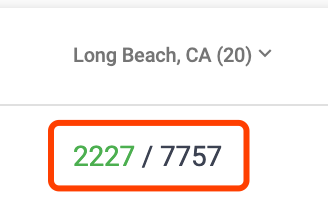

# 库存管理

## 库存数字的类型

S2 目前追踪两种库存的类型

- `Completed`
  已经到达仓库的，可以立即使用的库存数量
- `Pending`
  在运送/生产过程中，在未来某一时刻会变成`Completed`的库存数量

在系统的很多地方可以看到以这种格式显示的库存数字:

左边绿色部分的数字是`Completed`的库存，右面灰色部分的数字是`Completed` + `Pending`的库存。
大多数这种数字都可以点击，跳转到详情页面。
